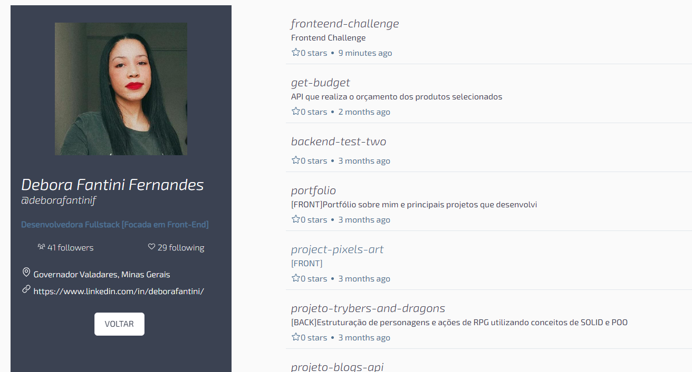

<h1 align="center">
  Search Perfil
</h1>

<h3 align="center">
  🏘️ Makasí - Teste Técnico
</h3>

  <a href="#-tecnologias">Tecnologias</a>&nbsp;&nbsp;&nbsp;|&nbsp;&nbsp;&nbsp;
  <a href="#-projeto">Projeto</a>&nbsp;&nbsp;&nbsp;|&nbsp;&nbsp;&nbsp;
  <a href="#-execução">Execução</a>&nbsp;&nbsp;&nbsp;|&nbsp;&nbsp;&nbsp;

 

  

## 👩‍💻 Tecnologias

Esse projeto foi desenvolvido com as seguintes tecnologias:

- [Node.js](https://nodejs.org/en/)
- [Vite](https://vitejs.dev/)
- [React](https://reactjs.org)
- [TypeScript](https://reactjs.org)
- [Axios](https://axios-http.com/docs/intro)
- [Styled Components](https://styled-components.com/)
- [Vercel](https://vercel.com)

Durante a execução do projeto, optei pelas ferramentas acima pela agilidade na produção e legibilidade do código. A escolha de usar Vite no projeto permitiu um setup mais rápido e eficiente, sendo um dos motivos, o fato de ter utilizado Typescript e o Vite já vir com as configurações necessárias. Optei pelo Typescript por tornar o código mais seguro e estrutura-lo melhor. Utilizei o styled-components por deixar mais limpa a parte da estilização. E por fim, usei o Vercel para o deploy por ele ser o mais prático para uma aplicação simples como essa.

## 💻 Projeto

O objetivo deste projeto é permitir que os usuários busquem perfis do GitHub e visualizem suas informações em um formato amigável. A aplicação utiliza a [API do GitHub](https://docs.github.com/en/rest?apiVersion=2022-11-28) para realizar a busca e exibe informações como o nome do usuário, a imagem de perfil, os repositórios públicos com maior número de estrelas, entre outros dados.

## 🤔 Execução

Você pode utilizar a aplicação por este [link](https://search-perfil.vercel.app/).

**Para inicialização do projeto dentro da máquina, siga os próximos passos**

- Tenha previamente instalado na sua máquina o Node.js e npm (ou yarn) e um editor de código (VS Code)

- Clone o repositório:

  `git clone git@github.com:deborafantinif/fronteend-challenge.git`

- Entre na pasta search-perfil e instale as dependências:

  `npm install`

- Acesse a aplicação com o script dev:

  `npm run dev`
